# 动效图鉴 · Motion Field Guide

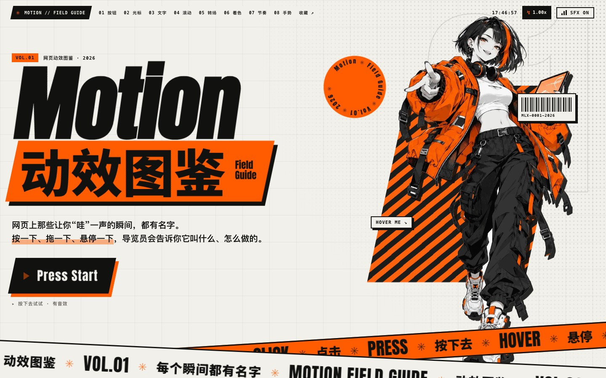

网页上那些让人“哇”一声的瞬间，其实都有名字。

这是一本**可以亲手按的网页动效图鉴**：每个效果都能玩、能调速度，导览员会告诉你它叫什么、怎么做出来的。它真正的用途是一本**词汇表**：看到一个喜欢的效果，就知道该怎么把它描述给开发者（或者 AI）听，比如“果冻回弹，速度 0.75x”。

> 这份 README 写给完全不懂前端的人。每个技术点都配了一个生活里的比喻，看比喻就够了，代码可以跳过。

---

## 目录

1. [怎么打开](#怎么打开)
2. [它是怎么一步步做出来的](#它是怎么一步步做出来的)
3. [拆解首页：一张网页是一摞图层](#拆解首页一张网页是一摞图层)
4. [拆解 9 个按钮](#拆解-9-个按钮)
5. [素材从哪来：从一句话到一张透明立绘](#素材从哪来从一句话到一张透明立绘)
6. [几个“看不见”的工程细节](#几个看不见的工程细节)
7. [谁做了什么](#谁做了什么)
8. [文件结构](#文件结构)
9. [下一步](#下一步)

---

## 怎么打开

打开终端，进入项目目录，运行：

```bash
python3 -m http.server 3300
```

然后用浏览器访问 `http://localhost:3300`，首页列出了所有版本。**手机和电脑都可以体验**：当前版本有八个展厅、43 件展品，支持触屏拖甩、A/B 参数对比、暂停逐帧、分享链接和独立代码导出。按钮展厅可以打开声音。第四期验收记录见 [交付报告](docs/phase4-report.md)。

> 为什么不能直接双击 HTML 文件？大部分页面其实也能打开，但浏览器对“本地文件”有很多安全限制（比如字体、复制到剪贴板），开一个小服务器最省心。

---

## 它是怎么一步步做出来的

这个项目一共试了三轮，每一轮都是“先做几个小样 → 看反馈 → 调整方向”。

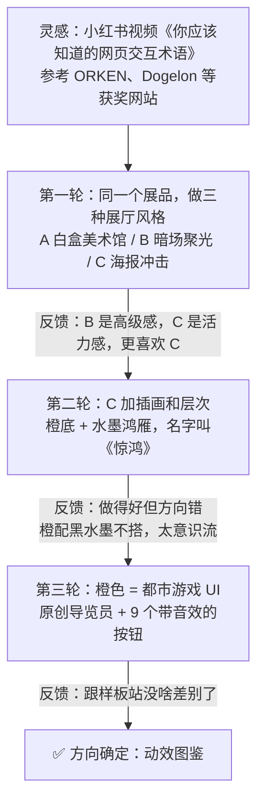

### 第一轮：三种展厅，选一个方向

先不急着做完整网站，而是用**同样两件展品**（磁吸按钮、图片拖尾），套进三种完全不同的展厅里对比。这样比较的只是“风格”，而不是“内容多少”。

| A 白盒美术馆 | B 暗场聚光 | C 海报冲击 |
|---|---|---|
| 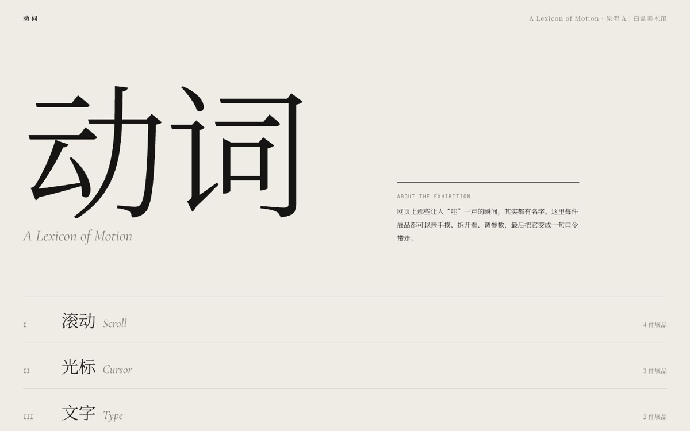 | 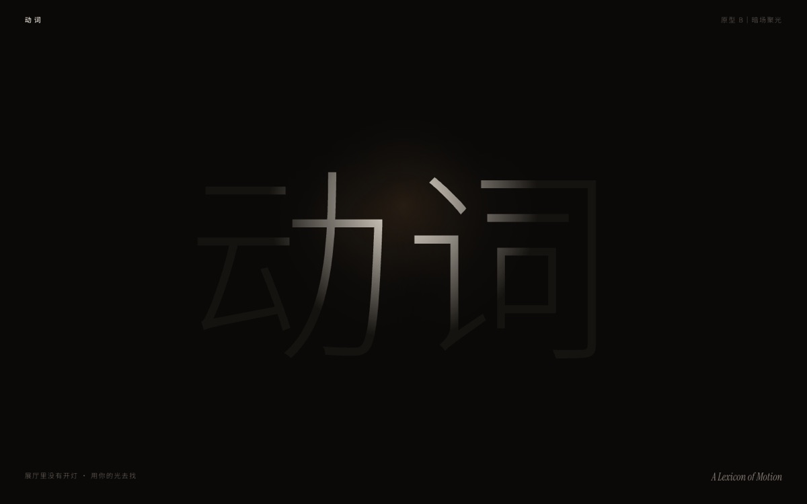 | 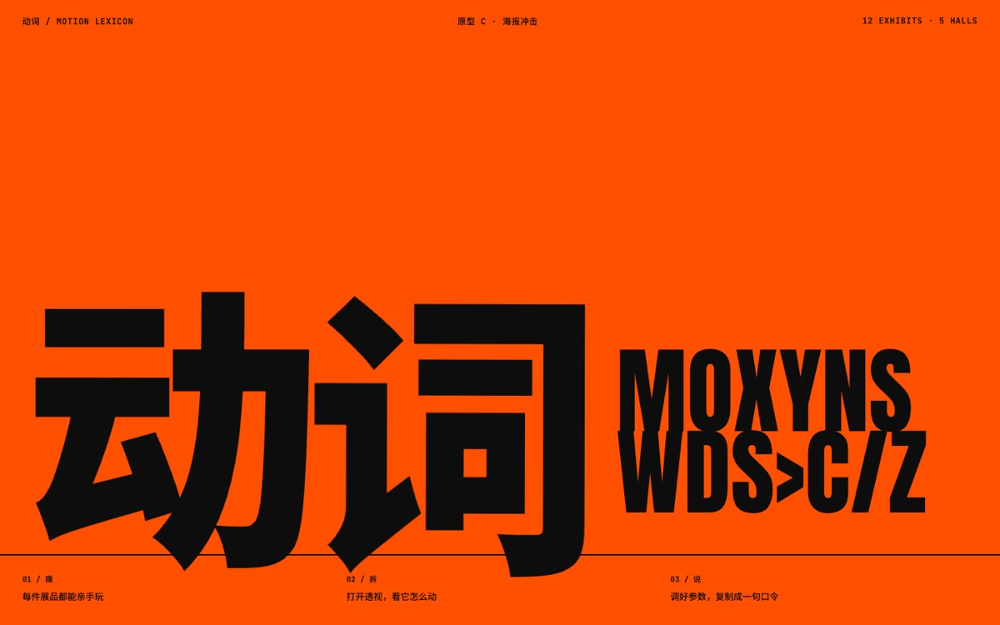 |
| 米白墙面、宋体，像博物馆展签 | 一片漆黑，**鼠标就是手电筒**，照到哪里才看见藏着的展签 | 橙黑大色块，英文标题先乱码再逐字锁定 |

结论：B 有高级感，C 有活力。选了 C。

### 第二轮：给 C 加画面，结果跑偏了

| 橙底水墨（《惊鸿》） | 同一页换成白底 |
|---|---|
| 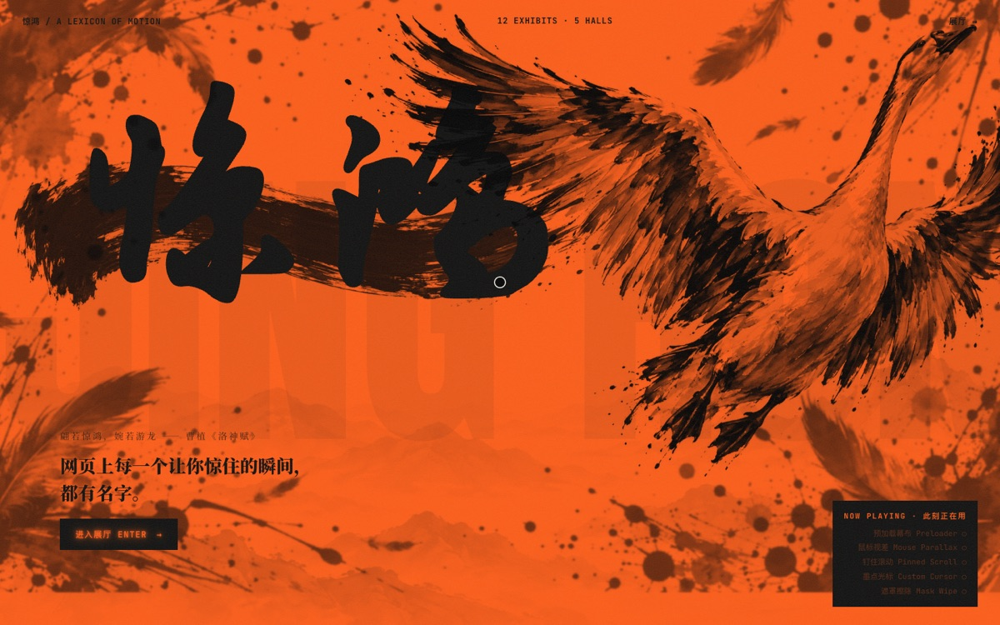 | 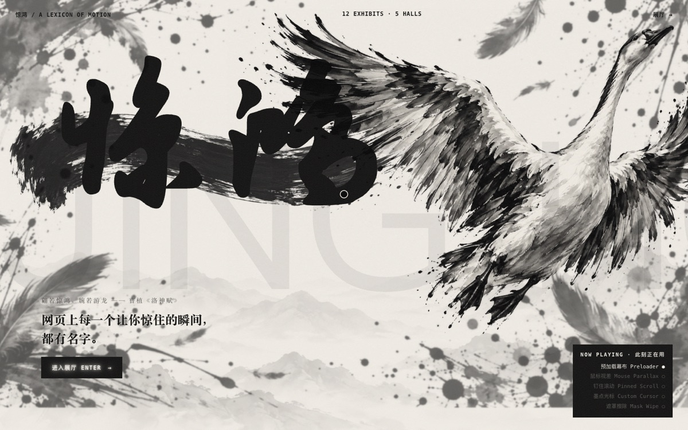 |

这一轮做了四层水墨插画（远山、笔触、鸿雁、墨点），技术上很完整，但**颜色没搭对**：橙色配黑水墨很别扭。反而换成白底以后，水墨马上就惊艳了。

教训：**先看颜色搭不搭，再谈概念。** 一个很美的名字（“惊鸿”）会把人一路带偏。

### 第三轮：橙色 = 都市游戏

橙色本来就是“信号色”：工地警示牌、街头路标、游戏 HUD 都用它。于是借用了都市潮流游戏的界面语言：斜切面板、网点阴影、警戒条纹、贴纸、粗斜体字，再加一个原创的导览员角色。这一版命中了。

---

## 拆解首页：一张网页是一摞图层

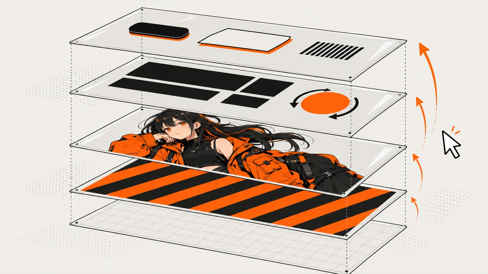

你看到的首页其实是**好几张透明的纸叠在一起**：最底下是网格背景，上面依次是橙黑条纹块、导览员、大标题、按钮和贴纸。每张纸都可以单独移动。

| 你看到的效果 | 名字 | 比喻 |
|---|---|---|
| 移动鼠标，导览员、条纹块、贴纸错开移动，有纵深感 | **鼠标视差** Mouse Parallax | 坐火车看窗外：近处的树飞快后退，远处的山几乎不动。每一层按“离你多远”决定移动多少 |
| 各种东西跟着鼠标走，但有一点“拖着”的弹性 | **插值追赶** Lerp | 遛狗：狗不会瞬间出现在你脚边，而是每一步追上剩下距离的一小截。追的比例越大，跟得越紧 |
| 两条交叉的橙白警戒带，滚得越快它们跑得越快 | **滚动速度跑马灯** Scroll Velocity Marquee | 量一下你这一瞬间滚了多远，把这个数加到跑马灯的速度上 |
| 点 PRESS START：闪白、震屏、跳到按钮展厅 | **闪屏 + 震屏** Flash & Screen Shake | 游戏里被打中时屏幕一闪一抖：一层白色瞬间出现再淡掉，整个页面左右快速晃几下 |
| 右边那个一直在转的圆形徽章 | **环形文字** Text on Path | 先画一个看不见的圆，让文字沿着圆排队，再让整个圆慢慢转 |
| 导览员对话框里一个字一个字冒出来的解说 | **打字机** Typewriter | 每隔几十毫秒多显示两个字，偶尔配一声“嗒” |

---

## 拆解 9 个按钮

每个按钮都由三部分组成：**画面怎么变 + 发出什么声音 + 导览员讲解**。

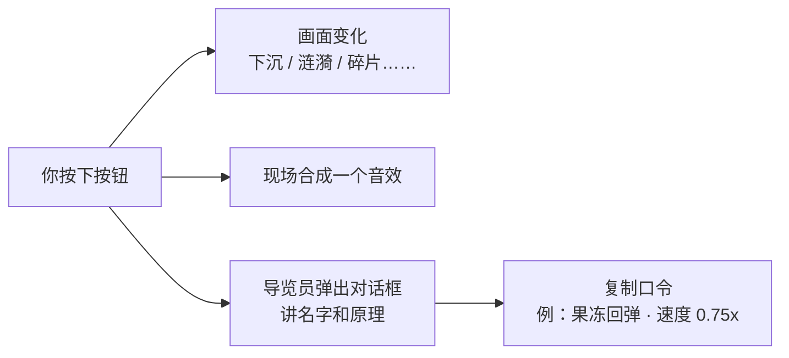

| # | 按钮 | 怎么触发 | 原理（一句话） |
|---|---|---|---|
| 01 | 按压下沉 Push Down | 按下 | 按钮下面藏着一条“厚度”。按下时按钮往下走、厚度变薄，像真的被压进去 |
| 02 | 涟漪 Ripple | 点击 | 在你点的位置画一个圆，从 0 放大到盖满按钮，同时变透明 |
| 03 | 填充擦除 Fill Wipe | 悬停 | 一块缩成 0 的色块，鼠标进来从左边展开，离开从右边收走 |
| 04 | 文字翻滚 Text Roll | 悬停 | 每个字母下面藏着一个复制品，整列往上推一格，每个字母晚一点出发，形成波浪 |
| 05 | 长按充能 Hold to Confirm | 按住 | 按住时进度条涨、音调升高，松手就漏回去，按满会爆开。专门防止手滑 |
| 06 | 粒子爆裂 Particle Burst | 点击 | 从中心朝随机方向射出十几块碎片，每块有自己的角度、距离和旋转 |
| 07 | 故障 Glitch | 悬停 | 同一行字复制成橙色和青色两份，每份只露出一条横带，左右错开快速切换 |
| 08 | 果冻回弹 Squash & Stretch | 点击 | 动画十二原则之一：先压扁再拉长，来回几次越来越小，看起来有弹性 |
| 09 | 错误抖动 Error Shake | 点击 | 左右晃几下、幅度越来越小，同时变红，就像有人摇头说“不行” |

### 音效是怎么来的？

**页面里一个音频文件都没有。** 所有声音都是浏览器自带的 Web Audio 现场“弹”出来的：

- 比喻：不是放录音，而是一台小电子琴。代码告诉它“用方波，从 150 赫兹滑到 60 赫兹，响 0.14 秒”，它就当场发出一声“咚”
- 长按充能的声音是一个一直响着的音，音高随进度条往上爬
- 爆炸声是一小段“沙沙”的白噪音，再叠一个往下掉的音

### 右上角的速度档

整个页面所有动画的时长都除以同一个数（`--spd`），就像**一个总开关**：调到 0.5x，所有动画一起慢一倍。你调到喜欢的手感，口令里会自动带上这个速度。

---

## 素材从哪来：从一句话到一张透明立绘

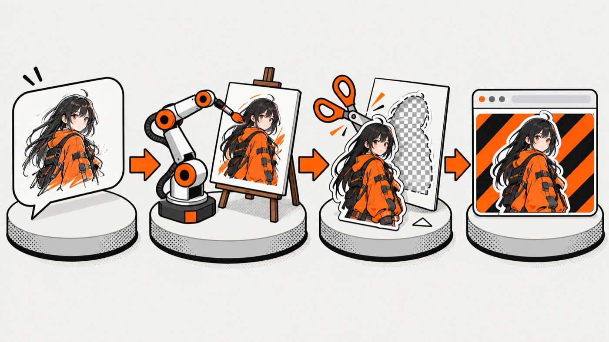

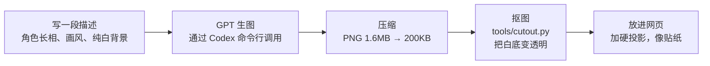

几个关键点：

- **为什么要求纯白背景？** 白底最好去掉。第二轮的水墨用的是“正片叠底”，白色叠到任何颜色上都会消失，就像在白纸上画的墨，透过来只剩墨；第三轮的导览员则是直接抠成透明
- **抠图怎么做的？** 比喻：从图片四条边往里“倒水”，水只能流过接近白色的地方，被黑色描边挡住。所有被水淹到的地方就是背景，把它们变透明。描边边缘再做一点半透明，避免锯齿
- **为什么两张图是同一个人？** 两次生成用了完全相同的角色描述（发型、挑染、外套、耳机……），描述写得越具体，长得越像

---

## 几个“看不见”的工程细节

| 细节 | 比喻 | 效果 |
|---|---|---|
| **字体子集化**：中文粗体字库只保留页面用到的 361 个字 | 搬家只带要用的书，不搬整个图书馆 | 17MB → 60KB |
| **字体本地托管**：不依赖 Google 字体服务 | 自己家里备一份，不用每次去邻居家借 | 国内也能稳定显示 |
| **数据驱动的展品**：名字、原理、代码、参数都写在一张表里 | 菜单和厨房分开：换菜单不用拆厨房 | 加新展品只要往表里加一行 |
| **透视模式**（第一轮原型里的磁吸、拖尾）：一键画出磁场范围、目标点、剩余距离 | 给效果拍 X 光 | 原理不靠文字讲，直接画给你看 |

---

## 谁做了什么

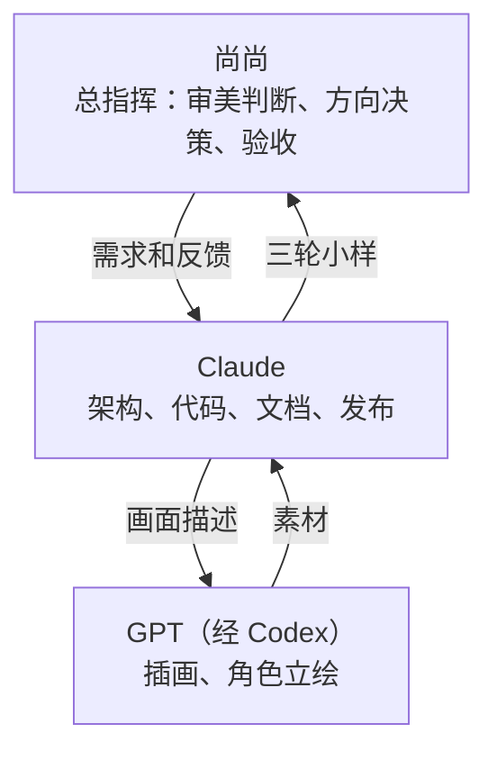

---

## 文件结构

```
motion-lexicon/
├── index.html            # 入口：所有版本的目录
├── proto/
│   ├── c3-city.html      # ⭐ 当前版本：动效图鉴（都市游戏风）
│   ├── c2-jinghong.html  # 第二轮：惊鸿（加 ?white 看白底版）
│   ├── a-gallery.html    # 第一轮 A：白盒美术馆
│   ├── b-dark.html       # 第一轮 B：暗场聚光
│   ├── c-poster.html     # 第一轮 C：海报冲击
│   ├── shared.js         # 第一轮共用的展品引擎（磁吸、拖尾、透视、口令）
│   └── shared.css
├── assets/
│   ├── city-web/         # 导览员立绘（已抠图、压缩）
│   ├── ink-web/          # 水墨图层
│   ├── web/              # 《凝固的瞬间》摄影风素材（拖尾用）
│   └── fonts/            # 子集化后的字体
├── tools/
│   ├── cutout.py         # 白底抠透明
│   └── build-artifact.py # 打包成单页发布
└── docs/images/          # 这份 README 用到的图
```

---

## 下一步

以下仅为提议，尚未实施：

- [ ] **可拖动时间轴与阶段标记**：直接定位蓄力、定格、冲击波和落地，方便逐帧研究
- [ ] **减少动态效果对照**：并排展示降低运动后如何保留相同的信息与反馈
- [ ] **双指手势与滚动协作**：补充捏合、旋转，以及手势与页面滚动的冲突处理

---

## 许可

- 代码：MIT
- 字体：Anton、Noto Sans SC、Zhi Mang Xing 均为 [SIL Open Font License](https://openfontlicense.org)，这里只包含子集
- 插画和角色立绘：由 AI 生成，为本项目原创
