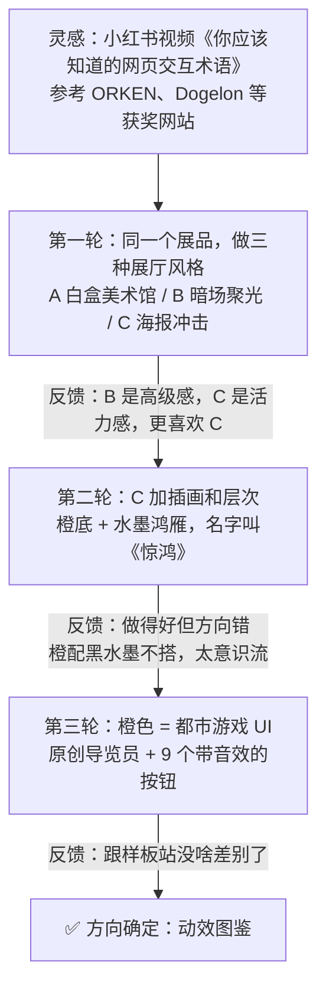
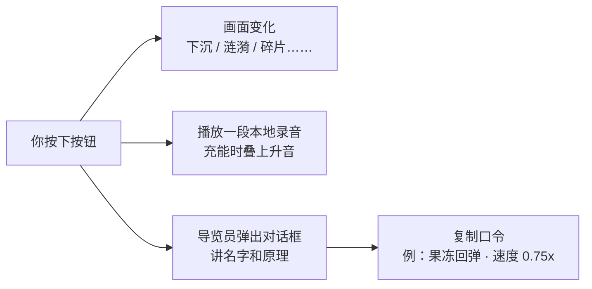
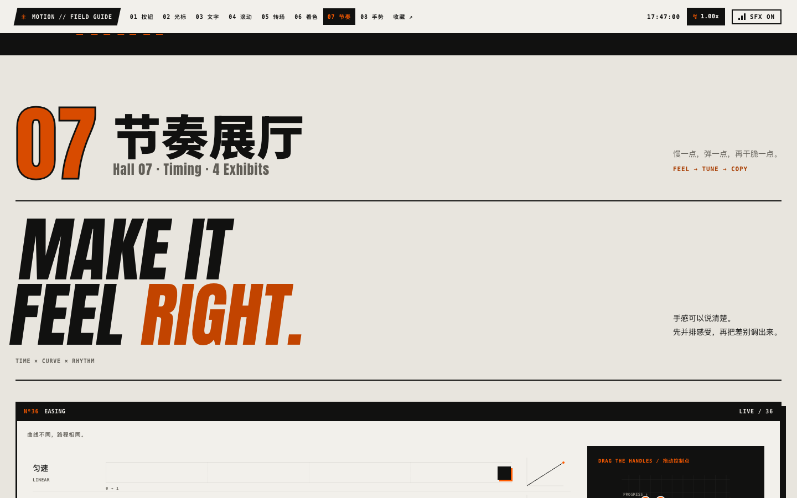
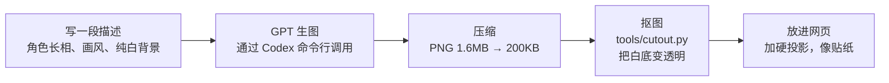
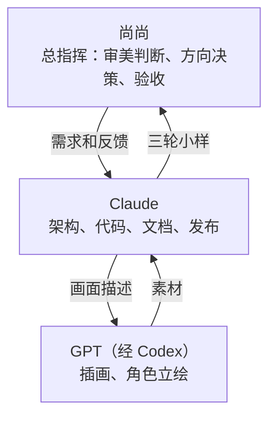

# 动效图鉴 · Motion Field Guide


网页上那些让人“哇”一声的瞬间，其实都有名字。

这是一本**可以亲手按的网页动效图鉴**：每个效果都能玩、能调速度，导览员会告诉你它叫什么、怎么做出来的。它真正的用途是一本**词汇表**：看到一个喜欢的效果，就知道该怎么把它描述给开发者（或者 AI）听，比如“果冻回弹，速度 0.75x”。

> 这份 README 写给完全不懂前端的人。每个技术点都配了一个生活里的比喻，看比喻就够了，代码可以跳过。

---

## 目录

1. [怎么打开](#怎么打开)
2. [它是怎么一步步做出来的](#它是怎么一步步做出来的)
3. [拆解首页：一张网页是一摞图层](#拆解首页一张网页是一摞图层)
4. [拆解 9 个按钮](#拆解-9-个按钮)
5. [从按钮展厅到八个街区](#从按钮展厅到八个街区)
6. [把手感说清楚，再带走](#把手感说清楚再带走)
7. [为什么会卡，又怎么变顺](#为什么会卡又怎么变顺)
8. [素材从哪来：从一句话到一张透明立绘](#素材从哪来从一句话到一张透明立绘)
9. [几个“看不见”的工程细节](#几个看不见的工程细节)
10. [谁做了什么](#谁做了什么)
11. [文件结构](#文件结构)
12. [下一步](#下一步)

---

## 怎么打开

打开终端，进入项目目录，运行：

```bash
python3 -m http.server 3300
```

然后用浏览器访问 `http://localhost:3300`，首页列出了所有版本。**手机和电脑都可以体验**：当前版本有八个展厅、43 件展品，支持触屏拖甩、A/B 参数对比、暂停逐帧、分享链接和独立代码导出。每张卡片默认只露出“口令／工具”，手机讲解跟在卡片下面。第一次来会收到一段可跳过的导览员问候。第五期验收见 [交付报告](docs/phase5-report.md) 和 [截图目录](docs/review/phase5/README.md)。

> 为什么不能直接双击 HTML 文件？大部分页面其实也能打开，但浏览器对“本地文件”有很多安全限制（比如字体、复制到剪贴板），开一个小服务器最省心。

---

## 它是怎么一步步做出来的

方向确定前，项目先试了三轮，每一轮都是“先做几个小样 → 看反馈 → 调整方向”。



### 第一轮：三种展厅，选一个方向

先不急着做完整网站，而是用**同样两件展品**（磁吸按钮、图片拖尾），套进三种完全不同的展厅里对比。这样比较的只是“风格”，而不是“内容多少”。

| A 白盒美术馆 | B 暗场聚光 | C 海报冲击 |
|---|---|---|
|  |  |  |
| 米白墙面、宋体，像博物馆展签 | 一片漆黑，**鼠标就是手电筒**，照到哪里才看见藏着的展签 | 橙黑大色块，英文标题先乱码再逐字锁定 |

结论：B 有高级感，C 有活力。选了 C。

### 第二轮：给 C 加画面，结果跑偏了

| 橙底水墨（《惊鸿》） | 同一页换成白底 |
|---|---|
|  |  |

这一轮做了四层水墨插画（远山、笔触、鸿雁、墨点），技术上很完整，但**颜色没搭对**：橙色配黑水墨很别扭。反而换成白底以后，水墨马上就惊艳了。

教训：**先看颜色搭不搭，再谈概念。** 一个很美的名字（“惊鸿”）会把人一路带偏。

### 第三轮：橙色 = 都市游戏

橙色本来就是“信号色”：工地警示牌、街头路标、游戏 HUD 都用它。于是借用了都市潮流游戏的界面语言：斜切面板、网点阴影、警戒条纹、贴纸、粗斜体字，再加一个原创的导览员角色。这一版命中了。

---

## 拆解首页：一张网页是一摞图层


你看到的首页其实是**好几张透明的纸叠在一起**：最底下是网格背景，上面依次是橙黑条纹块、导览员、大标题、按钮和贴纸。每张纸都可以单独移动。

| 你看到的效果 | 名字 | 比喻 |
|---|---|---|
| 移动鼠标，导览员、条纹块、贴纸错开移动，有纵深感 | **鼠标视差** Mouse Parallax | 坐火车看窗外：近处的树飞快后退，远处的山几乎不动。每一层按“离你多远”决定移动多少 |
| 各种东西跟着鼠标走，但有一点“拖着”的弹性 | **插值追赶** Lerp | 遛狗：狗不会瞬间出现在你脚边，而是每一步追上剩下距离的一小截。追的比例越大，跟得越紧 |
| 两条交叉的橙白警戒带，滚得越快它们跑得越快 | **滚动速度跑马灯** Scroll Velocity Marquee | 量一下你这一瞬间滚了多远，把这个数加到跑马灯的速度上 |
| 点 PRESS START：闪白、震屏、跳到按钮展厅 | **闪屏 + 震屏** Flash & Screen Shake | 游戏里被打中时屏幕一闪一抖：一层白色瞬间出现再淡掉，整个页面左右快速晃几下 |
| 右边那个一直在转的圆形徽章 | **环形文字** Text on Path | 先画一个看不见的圆，让文字沿着圆排队，再让整个圆慢慢转 |
| 导览员对话框里一个字一个字冒出来的解说 | **打字机** Typewriter | 每隔几十毫秒多显示两个字，偶尔配一声“嗒” |

---

## 拆解 9 个按钮

每个按钮都由三部分组成：**画面怎么变 + 发出什么声音 + 导览员讲解**。



| # | 按钮 | 怎么触发 | 原理（一句话） |
|---|---|---|---|
| 01 | 按压下沉 Push Down | 按下 | 按钮下面藏着一条“厚度”。按下时按钮往下走、厚度变薄，像真的被压进去 |
| 02 | 涟漪 Ripple | 点击 | 在你点的位置画一个圆，从 0 放大到盖满按钮，同时变透明 |
| 03 | 填充擦除 Fill Wipe | 悬停 | 一块缩成 0 的色块，鼠标进来从左边展开，离开从右边收走 |
| 04 | 文字翻滚 Text Roll | 悬停 | 每个字母下面藏着一个复制品，整列往上推一格，每个字母晚一点出发，形成波浪 |
| 05 | 长按充能 Hold to Confirm | 按住 | 按住时进度条涨、音调升高，松手就漏回去，按满会爆开。专门防止手滑 |
| 06 | 粒子爆裂 Particle Burst | 点击 | 先收紧、停两三帧，再放出闪光、冲击波、火花与有重力的碎片，最后留一层淡烟 |
| 07 | 故障 Glitch | 悬停 | 同一行字复制成橙色和米白两份，每份只露出一条横带，左右错开快速切换 |
| 08 | 果冻回弹 Squash & Stretch | 点击 | 动画十二原则之一：先压扁再拉长，来回几次越来越小，看起来有弹性 |
| 09 | 错误抖动 Error Shake | 点击 | 左右晃几下、幅度越来越小，同时变红，就像有人摇头说“不行” |

### 音效是怎么来的？

现在的主体是 **41 个真实录音文件，总共约 323KB**，全部下载在项目里，国内访问也不用等外部音效服务器。来自 Kenney 的 [Interface Sounds](https://kenney.nl/assets/interface-sounds)、[Impact Sounds](https://kenney.nl/assets/impact-sounds) 和 [Digital Audio](https://kenney.nl/assets/digital-audio)，全部采用 CC0 许可，可商用且无需署名。逐个文件的来源与原包许可见 [音效清单](assets/sfx/LICENSES.md)。

- **录音加合成层**：像给电影配音，真实的“咚”和碎裂声负责质感，小电子琴负责长按时持续上升的充能音。
- **避免复读**：同一个动作备两三种录音，像敲门时每一下都略有不同；不连续选同一个文件，再随机改变一点音高（±5%）和音量。
- **按需加载**：像点菜后才开火，第一次交互后只准备需要的声音，不在进门时把 41 个录音全解码。
- **静音**：像关掉收音机，正在响的录音和充能音一起停下。浏览器要求先点一下页面，声音才能开始。

### 右上角的速度档

右上角的速度数字是一扇小抽屉，点开才露出播放控制台。它像**录像机的总旋钮**：0.5x 让所有展厅一起慢一倍，0.1x 可以仔细看爆炸和回弹；暂停会停住整个页面，逐帧键每次只推进一帧。你调到喜欢的手感，口令也会记住这个速度。

---

## 从按钮展厅到八个街区

方向确定之后，四期施工把最初的 9 个按钮扩成了 **8 个展厅、43 件展品**。第五期把界面收干净：演示仍是主角，复制口令就在名字旁边，分享、代码、A/B、讲解和感觉标签放在“工具”里。像把工作台上的扳手收进抽屉，想用时依然一伸手就拿得到。

| 展厅 | 可以亲手试什么 | 生活里的比喻 |
|---|---|---|
| 01 按钮 · 12 件 | 按压、涟漪、充能、爆裂、果冻，以及倾斜、开关、提交状态 | 从实体按键的下沉，到拉开汽水罐的爆点，每种动作都有反馈 |
| 02 光标 · 5 件 | 磁吸、图片拖尾、聚光灯、反色光标、墨迹 | 鼠标可以是一块磁铁、一支手电筒，也可以是一支带尾巴的画笔 |
| 03 文字 · 5 件 | 逐字错落、乱码解码、字重波浪、遮罩填充、打字机 | 字像排队出场的演员，或逐个亮起来的路灯 |
| 04 滚动 · 5 件 | 视差、钉住、横卷、揭示、速度形变 | 向下滚就是转动电影胶片：画面可以前进，也可以留在原地换一幕 |
| 05 转场 · 4 件 | FLIP、共享元素、幕布、浏览器原生转场 | 家具挪位置时仍看得到它怎么走；小照片变大，像把相片拿到眼前 |
| 06 着色器 · 4 件 | 液体扭曲、噪声溶解、流动渐变、粒子成形 | 显卡像一排同时工作的画师，每个人负责画面上的一点颜色 |
| 07 节奏 · 4 件 | 缓动曲线、弹簧物理、时长、错落节奏 | 同一段路，先冲刺再刹车，和一路匀速走，感觉完全不同 |
| 08 手势 · 4 件 | 惯性拖拽、边界回弹、滑卡、下拉刷新 | 推一个重箱子、拉一根橡皮筋、甩走一张纸牌，把重量与阻力放到手指上 |

**爆炸为什么更有劲？** 像电影里的拳头：先有一小下蓄力，碰到时画面停两三帧，再叠闪光、扩散的环、拉长的火花、会减速下坠的碎片和最后的淡烟。长按确认还加一点屏幕微震。几层反馈踩在同一个爆点上，才会有打击感。

**导览员的表情**像游戏里会回应现场的 NPC：讲原理时认真，爆炸时捂耳朵，0.1x 慢放时打哈欠，还会得意和眨眼比耶。五张立绘沿用同一个人的发型、挑染、外套和耳机；当前需要哪张才加载哪张，像演员轮到出场时才走上舞台。

**X-RAY 透视**像在练习场画上轨迹线。磁场范围、目标点、剩余距离直接显示在演示里，不用靠想象理解磁吸怎么追过去。

**手机着色器**像把电视调到较低分辨率：仍是同一个实时画面，只让显卡少画一些像素、少处理一些粒子。设备太慢、没有 WebGL 或打开“减少动态效果”时，就放静态预览并说明原因，页面仍能继续逛。

---

## 把手感说清楚，再带走



“再弹一点”很有用，但不同人理解的弹并不一样。节奏展厅让这句话有了可以比较、可以恢复的数值。

| 功能 | 怎么用 | 生活里的比喻 |
|---|---|---|
| **缓动曲线** | 五种预设与自定义曲线一起跑；拖两个控制点，也能用方向键或输入数字 | 同一段路程分配不同的油门与刹车：先快后慢，就像靠站时轻轻停住 |
| **弹簧物理** | 调刚度与阻尼，比较软糯、干脆和果冻 | 换一根更硬的弹簧，再加一点减震器，决定弹多远、多久停下来 |
| **时长与错落** | 比较 100 / 300 / 800ms，调一排卡片的间隔和方向 | 一个决定每位演员走多快，另一个决定他们隔多久依次上台 |
| **A/B 对比** | 在工具里把当前参数存为 A，继续调出 B，两组同时播放 | 试鞋时两只脚各穿一双，差别能直接感觉出来，不必靠记忆 |
| **暂停与逐帧** | 打开右上角控制台；空格暂停，暂停后按 `.` 前进一帧 | 像拆电影镜头，能停在蓄力、定格、冲击波和落地的任一阶段 |
| **口令读回** | 复制口令，粘到收藏页的输入框里 | 一张配方卡，记住展品、速度、曲线、参数和 A/B 两套配置；再拿回来照着做 |
| **分享链接** | 工具里点分享，另一个人打开就恢复参数并定位展品 | 给朋友寄一张已经调好座椅和后视镜的试驾券，打开就是同一份手感 |
| **拿走代码** | 工具里点代码，预览后复制或下载独立 HTML | 把一道菜的完整小食谱带走，HTML、CSS、JS 都在里面，不用安装其他材料 |
| **感觉索引** | 在收藏页选“弹”“有重量”等标签，找它们的交集 | 不知道菜名，也能先说“想吃酸甜的”，再从符合口味的菜里挑 |

例如 `弹簧物理 Spring｜速度 0.75x｜刚度 250 · 阻尼 7 · 质量 1`，既是一句能读懂的话，也是一张能还原的配方。调错了参数，输入框会说明问题，已有手感不会被改到一半。

---

## 为什么会卡，又怎么变顺

页面变长以后，卡顿不一定是某一个效果复杂，更可能是**所有房间同时开灯、同时工作**。第三期先用 Chrome 时间线测量，再做优化；第四期加手势与 A/B 后复测，第五期继续复测并保留原始记录。

| 测量场景 | 第三期优化前 → 优化后 | 这意味着什么 |
|---|---|---|
| 全页匀速滚动 | 59.60 → 59.97fps；掉帧 12 → 1；大于 50ms 的长任务 1 → 0 | 每秒 60 张画面基本按时送到，滚动时少了突然停顿 |
| 首屏连续移动鼠标 | 56.84 → 60.00fps；掉帧 19 → 0 | 立绘和贴纸跟手移动时，不再频繁漏掉画面 |
| 全页滚动的强制布局 | 3,795 → 96 次 | 少了“刚挪完家具，马上又拿尺子量房间”的反复折腾 |

这些数字来自本机 Chrome、60Hz、1440×900、无 CPU 节流。它们用来比较同一台机器的前后版本，不能保证每一部手机都有相同帧率。详细口径见 [第三期报告](docs/phase3-report.md)、[第四期报告](docs/phase4-report.md) 和 [第五期报告](docs/phase5-report.md)。

| 做了什么 | 生活里的比喻 | 为什么更顺 |
|---|---|---|
| **统一帧调度器** `frame.js` | 一位总指挥打拍子，每位乐手跟着同一只节拍器 | 所有动效共用一个时钟，暂停、慢放和逐帧也能一起走 |
| **离屏暂停** | 离开房间就关灯，回来才继续演示 | 看不到的 Canvas、WebGL 和展厅循环不再白忙 |
| **缓存尺寸、集中测量** | 先量好房间，再搬家具；房间大小变了才重测 | 减少读尺寸与写样式交错造成的布局抖动 |
| **只移动图层** | 移动一张画好的贴纸，胜过每次重新画一张 | 导览员的硬阴影烘焙进图片，动画尽量只改变位置和透明度 |
| **限制画布分辨率** | 小屏幕不必搬来电影院的胶片 | 高 DPI 不再让画布按无限倍像素工作，手机着色器使用 DPR 1 |
| **跳过离屏排版** | 尚未走到的展厅先保留占地位置，不急着摆好展品 | `content-visibility` 让浏览器少排版、少重绘 |
| **提前解码、按需取货** | 图片在到达下一个展厅前拆好包装，工具等要用时才取 | 缓解进门时的突然忙碌，也缩短首屏等待 |

首次开启声音仍可能有一次音频设备冷启动，像音响第一次通电需要热机；报告保留这次开销，没有在测量前偷偷提前打开声音。

第五期给首屏做了“减重”：透明立绘改为 WebP，手机图约 72KB；首屏中文单独装进约 32KB 的小字库，逛展时再取其余字；首屏样式直接写在入口里，其余展厅样式与工具分批加载。像出门先带车票和钥匙，大行李等到站再取。手机慢网、冷缓存的 Lighthouse 性能分从 **74 提升到 92**，首个内容从 2.4 秒到 1.9 秒，最大内容从 6.6 秒到 3.2 秒。像进门先拿到地图、马上看见导览员，后面的工具不必一起挤在门口；完整测量条件与原始记录见 [第五期报告](docs/phase5-report.md)。

---

## 素材从哪来：从一句话到一张透明立绘




几个关键点：

- **为什么要求纯白背景？** 白底最好去掉。第二轮的水墨用的是“正片叠底”，白色叠到任何颜色上都会消失，就像在白纸上画的墨，透过来只剩墨；第三轮的导览员则是直接抠成透明
- **抠图怎么做的？** 比喻：从图片四条边往里“倒水”，水只能流过接近白色的地方，被黑色描边挡住。所有被水淹到的地方就是背景，把它们变透明。描边边缘再做一点半透明，避免锯齿
- **为什么两张图是同一个人？** 两次生成用了完全相同的角色描述（发型、挑染、外套、耳机……），描述写得越具体，长得越像

---

## 几个“看不见”的工程细节

| 细节 | 比喻 | 效果 |
|---|---|---|
| **字体子集化**：中文粗体只保留当前页面用到的字，再拆成首屏与展厅两份 | 搬家只带要用的书，不搬整个图书馆 | 完整字库约 10MB → 首屏约 32KB + 展厅约 112KB |
| **字体本地托管**：不依赖 Google 字体服务 | 自己家里备一份，不用每次去邻居家借 | 国内也能稳定显示 |
| **数据驱动的展品**：名字、原理、代码、参数都写在一张表里 | 菜单和厨房分开：换菜单不用拆厨房 | 加新展品只要往表里加一行 |
| **透视模式**（第一轮原型里的磁吸、拖尾）：一键画出磁场范围、目标点、剩余距离 | 给效果拍 X 光 | 原理不靠文字讲，直接画给你看 |

---

## 谁做了什么



---

## 文件结构

```
motion-lexicon/
├── index.html            # 入口：所有版本的目录
├── proto/
│   ├── c3-city.html      # ⭐ 当前版本：动效图鉴（都市游戏风）
│   ├── c2-jinghong.html  # 第二轮：惊鸿（加 ?white 看白底版）
│   ├── a-gallery.html    # 第一轮 A：白盒美术馆
│   ├── b-dark.html       # 第一轮 B：暗场聚光
│   ├── c-poster.html     # 第一轮 C：海报冲击
│   ├── shared.js         # 第一轮共用的展品引擎（磁吸、拖尾、透视、口令）
│   ├── shared.css
│   └── c3/              # 展厅模块、统一时钟、声音、工具与分享
├── assets/
│   ├── city-web/         # 导览员立绘（已抠图、压缩）
│   ├── ink-web/          # 水墨图层
│   ├── web/              # 《凝固的瞬间》摄影风素材（拖尾用）
│   ├── fonts/            # 子集化后的字体
│   └── sfx/              # 41 个 CC0 本地音效与来源许可
├── tools/
│   ├── cutout.py         # 白底抠透明
│   ├── build-artifact.py # 打包成单页发布
│   ├── motion-trace.mjs  # 用浏览器时间线复测帧率与布局
│   └── phase5-*.mjs     # 跨浏览器、无障碍与截图验收（依赖装在项目外）
└── docs/
    ├── images/           # 这份 README 用到的图
    └── review/phase5/    # 最新截图、Lighthouse 与跨浏览器检查
```

---

## 下一步

以下仅为提议，尚未实施：

- [ ] **可拖动时间轴与阶段标记**：直接定位蓄力、定格、冲击波和落地，方便逐帧研究
- [ ] **减少动态效果对照**：并排展示降低运动后如何保留相同的信息与反馈
- [ ] **双指手势与滚动协作**：补充捏合、旋转，以及手势与页面滚动的冲突处理

---

## 许可

- 代码：MIT
- 字体：Anton、Noto Sans SC、Zhi Mang Xing 均为 [SIL Open Font License](https://openfontlicense.org)，这里只包含子集
- 音效：Kenney，CC0 1.0；来源与原包许可见 [音效清单](assets/sfx/LICENSES.md)
- 插画和角色立绘：由 AI 生成，为本项目原创
